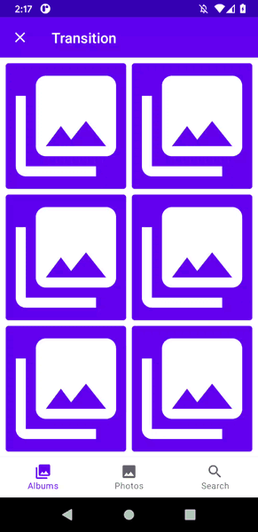

# Material Motion for Jetpack Compose

<a href="https://jitpack.io/#fornewid/material-motion-compose"></a>
<a href="https://github.com/fornewid/material-motion-compose/actions/workflows/build.yaml"></a>
<a href="https://opensource.org/licenses/Apache-2.0"></a>
<a href='https://developer.android.com'></a>

Jetpack Compose library for implementing [motion system](https://material.io/develop/android/theming/motion/) in Material Components for Android.

## Installation

Add Jitpack repository to your project's `build.gradle`:
```
allprojects {
    repositories {
        maven { url "https://jitpack.io" }
    }
}
```

And add the dependency. Depend on the [latest version](https://github.com/fornewid/material-motion-compose/releases) of the library.
```
dependencies {
    implementation 'com.github.fornewid:material-motion-compose:<version>'
}
```

## Usage

This library provides support for [motion patterns](https://material.io/design/motion/the-motion-system.html) defined in the Material spec.

### Shared axis

```kt
val (screen, onScreenChanged) = remember { mutableStateOf(...) }
MaterialSharedAxis(
    targetState = screen,
    axis = Axis.X,
    forward = true,
    slideDistance = 30.dp // (optional)
) { newScreen ->
    // composable according to screen
}

// or

MaterialMotion(
    targetState = screen,
    motionSpec = materialSharedAxis(
        axis = Axis.X,
        forward = true,
        slideDistance = 30.dp // (optional)
    )
) { newScreen ->
    // composable according to screen
}
```

| Axis X                     | Axis Y                     | Axis Z                     |
| -------------------------- | -------------------------- | -------------------------- |
|  |  |  |

### Fade through

```kt
val (screen, onScreenChanged) = remember { mutableStateOf(...) }
MaterialFadeThrough(
    targetState = screen
) { newScreen ->
    // composable according to screen
}

// or

MaterialMotion(
    targetState = screen,
    motionSpec = materialFadeThrough()
) { newScreen ->
    // composable according to screen
}
```

| Fade Through               |
| -------------------------- |
|  |

### Fade

```kt
val (screen, onScreenChanged) = remember { mutableStateOf(...) }
MaterialFade(
    targetState = screen
) { newScreen ->
    // composable according to screen
}

// or

MaterialMotion(
    targetState = selectedTab,
    motionSpec = materialFade()
) { newScreen ->
    // composable according to screen
}
```

| Fade                       |
| -------------------------- |
|  |

### Elevation scale

```kt
val (screen, onScreenChanged) = remember { mutableStateOf(...) }
MaterialMotion(
    targetState = screen,
    motionSpec = materialElevationScale(growing = false)
) { newScreen ->
    // composable according to screen
}
```

| ElevationScale             |
| -------------------------- |
|  |

### Hold

```kt
val (screen, onScreenChanged) = remember { mutableStateOf(...) }
MaterialMotion(
    targetState = screen,
    motionSpec = hold()
) { newScreen ->
    // composable according to screen
}
```

| Hold                       |
| -------------------------- |
|  |

### Crossfade

```kt
val (screen, onScreenChanged) = remember { mutableStateOf(...) }
Crossfade(
    targetState = screen
) { newScreen ->
    // composable according to screen
}

// or

MaterialMotion(
    targetState = selectedTab,
    motionSpec = crossfade()
) { newScreen ->
    // composable according to screen
}
```
or use [Crossfade](https://github.com/androidx/androidx/blob/androidx-main/compose/animation/animation/src/commonMain/kotlin/androidx/compose/animation/Crossfade.kt) in compose-animation.

| Crossfade                  |
| -------------------------- |
|  |

### More...

- `alpha()`
- `rotate()`
- `scale()`
- `translate()`

### If you want to use different motions depending on the state:

```kt
val (screen, onScreenChanged) = remember { mutableStateOf(...) }
val motionSpec = when (screen) {
   ... -> fadeThrough()
   ... -> sharedAxisY(forward = true)
   ...
}
MaterialMotion(
    targetState = screen,
    motionSpec = motionSpec,
    pop = false // whether motion contents are rendered in reverse order.
) { newScreen ->
    // composable according to screen
}

// or

MaterialMotion(
    targetState = screen,
    enterMotionSpec = motionSpec,
    exitMotionSpec = motionSpec,
    pop = false // whether motion contents are rendered in reverse order.
) { newScreen ->
    // composable according to screen
}
```

| Demo                       |
| -------------------------- |
|  |

### If you want to change motion durations:

You need to call the `ProvideMaterialMotions` function with custom durations and wrap your content.

This would typically be done near the top level of your composable hierarchy.

```kt
setContent {
  MaterialTheme {
    ProvideMaterialMotions(
        durations = Durations(...)
    ) {
      // your content
    }
  }
}
```

## License
Licensed under the Apache 2.0 license. See [LICENSE](https://github.com/fornewid/material-motion-compose/blob/main/LICENSE) for details.
