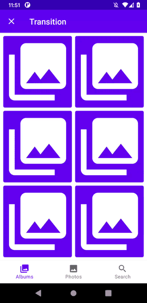

# Material Motion Core

[](https://search.maven.org/search?q=g:io.github.fornewid)

Material Motion Core is a Jetpack Compose library for implementing [motion system](https://material.io/develop/android/theming/motion/) in Material Components for Android.

## Usage

This library provides support for [motion patterns](https://material.io/design/motion/the-motion-system.html) defined in the Material spec.

### Shared axis

```kt
val (screen, onScreenChanged) = remember { mutableStateOf(...) }
MaterialSharedAxisX(
    targetState = screen,
    forward = true,
    slideDistance = 30.dp // (optional)
) { newScreen ->
    // composable according to screen
}

// or

val slideDistance = rememberSlideDistance(slideDistance = 30.dp)
MaterialMotion(
    targetState = screen,
    motionSpec = {
        materialSharedAxisX(forward = forward, slideDistance = slideDistance)
    },
    pop = forward.not()
) { newScreen ->
    // composable according to screen
}
```

| Axis X                     | Axis Y                     | Axis Z                     |
| -------------------------- | -------------------------- | -------------------------- |
|  |  |  |

### Fade through

```kt
val (screen, onScreenChanged) = remember { mutableStateOf(...) }
MaterialFadeThrough(
    targetState = screen
) { newScreen ->
    // composable according to screen
}

// or

MaterialMotion(
    targetState = screen,
    motionSpec = { materialFadeThrough() }
) { newScreen ->
    // composable according to screen
}
```

| Fade Through               |
| -------------------------- |
|  |

### Fade

```kt
val (visible, onVisibleChanged) = remember { mutableStateOf(...) }
MaterialFade(
    visible = visible
) {
    // composable to show
}
```

| Fade                       |
| -------------------------- |
|  |

### Elevation scale

```kt
val (screen, onScreenChanged) = remember { mutableStateOf(...) }
MaterialMotion(
    targetState = screen,
    motionSpec = { materialElevationScaleIn() with ... }
    // or
    motionSpec = { ... with materialElevationScaleOut() }
) { newScreen ->
    // composable according to screen
}
```

| ElevationScale             |
| -------------------------- |
|  |

### Hold

```kt
val (screen, onScreenChanged) = remember { mutableStateOf(...) }
MaterialMotion(
    targetState = screen,
    motionSpec = { holdIn() with ... }
    // or
    motionSpec = { ... with holdOut() }
) { newScreen ->
    // composable according to screen
}
```

| Hold                       |
| -------------------------- |
|  |

### If you want to use different motions depending on the state:

```kt
val (screen, onScreenChanged) = remember { mutableStateOf(...) }
val slideDistance = rememberSlideDistance(slideDistance = 30.dp)
MaterialMotion(
    targetState = screen,
    motionSpec = {
        when (targetState) {
           ... -> materialSharedAxisY(forward = true, slideDistance = slideDistance)
           ... -> materialFadeThroughIn() with materialFadeThroughOut()
           ...
        }
    },
    pop = false // whether motion contents are rendered in reverse order.
) { newScreen ->
    // composable according to screen
}
```

| Demo                       |
| -------------------------- |
|  |

### If you want to change motion durations:

Just pass a duration(=ms) directly when creating material motion.

For example:
```kt
val motionSpec = materialFadeThrough(durationMillis = 300)
```

## Download

[](https://search.maven.org/search?q=g:io.github.fornewid)

```gradle
repositories {
    mavenCentral()
}

dependencies {
    implementation "io.github.fornewid:material-motion-compose-core:<version>"
}
```
